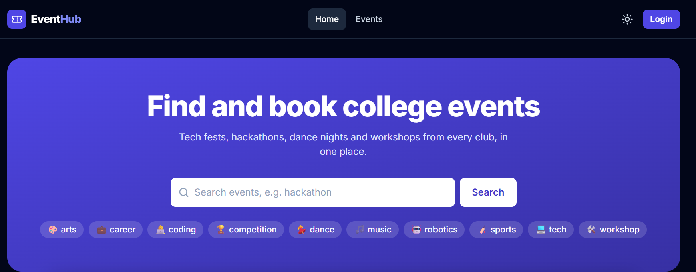
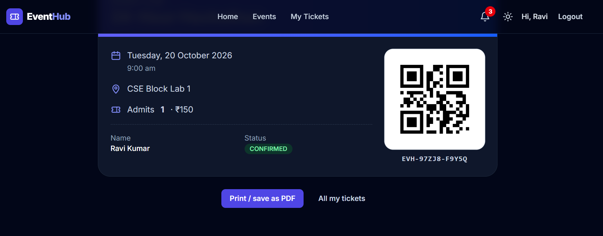
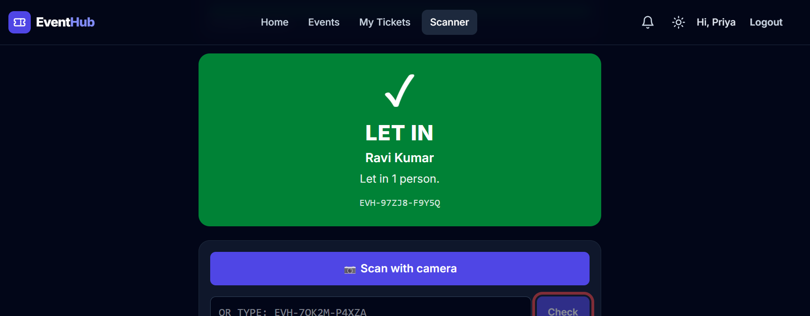
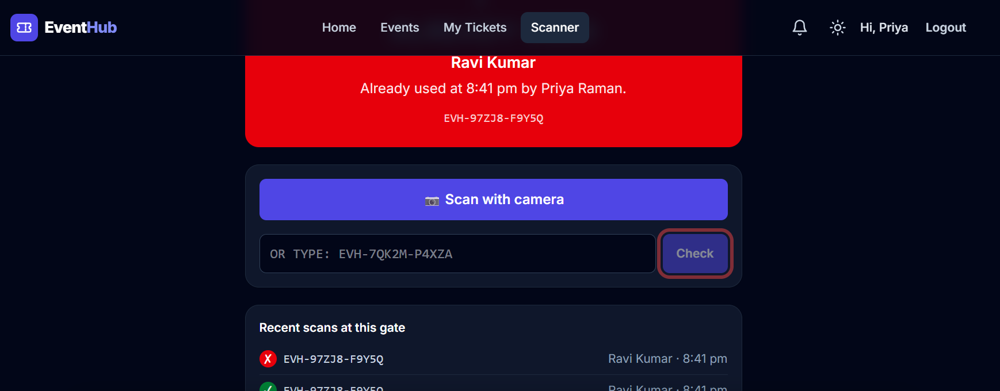
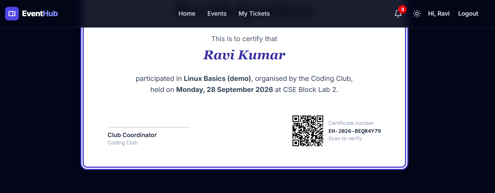
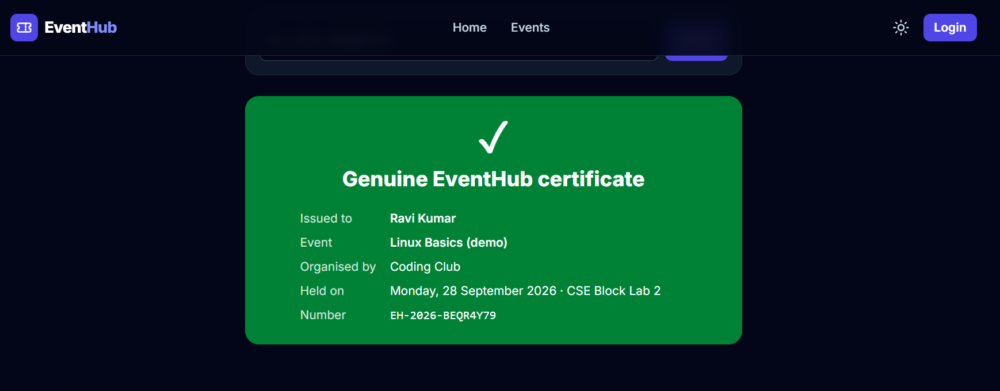
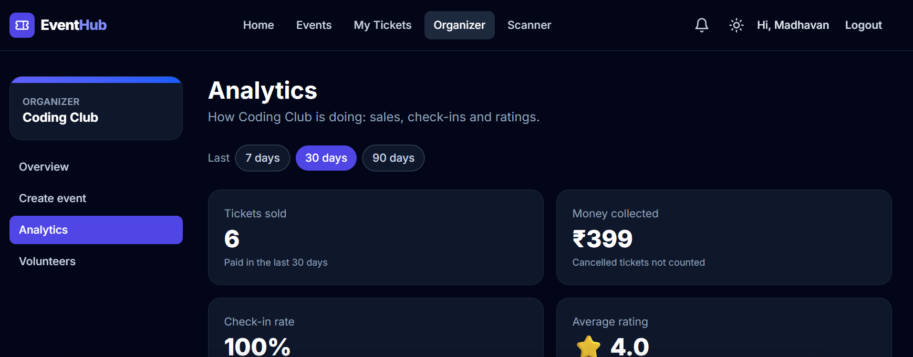
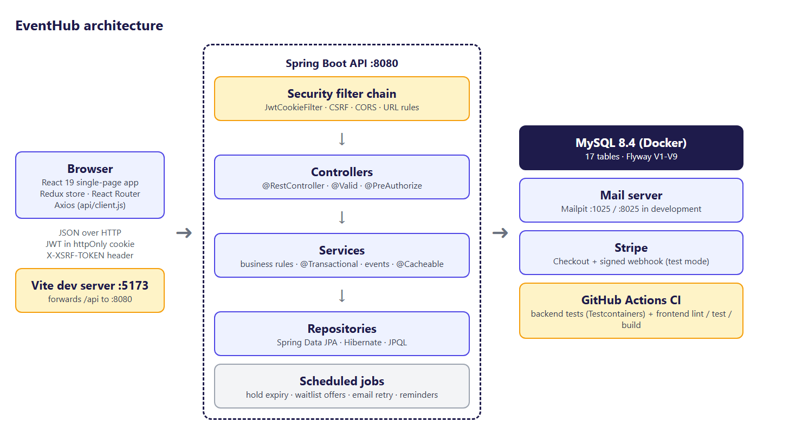

# EventHub 🎟️


**BookMyShow for your college.** A full stack event platform built with **Spring Boot 4 + React 19 + MySQL 8.4**.

Students find events, book and pay (seats held for 10 minutes), enter with a **one-time QR ticket**, and download a **verifiable PDF certificate**. Clubs create events, the admin approves them, and volunteers scan tickets at the gate.



## The problem it solves
College events usually run on WhatsApp groups and Google Forms, which leads to:
- **Overbooking**: two students get the same last seat.
- **Fake entries**: ticket screenshots get shared.
- **Late or fake certificates** on resumes.
- **No numbers** for organizers.

EventHub fixes each one with a rule enforced on the server.

## Features
| For | What they can do |
|---|---|
| Visitors | Search and filter events (text, tag, club, date), see live seat counts, verify a certificate |
| Students | Book 1–10 seats (10-minute hold), pay (Stripe test mode or built-in test page), QR tickets, cancel with refund, join a **smart waitlist**, bell and email notifications, certificates, 1–5 star feedback |
| Organizers | Create and edit their club's events, submit for approval, dashboard, **analytics** (tickets and money per day, check-in rate, ratings), anonymous feedback |
| Volunteers | **Gate scanner** (camera or typed code): LET IN / ALREADY USED / STOP, with a live counter |
| Admin | Approval queue (approve / send back with a reason), overview per club, activity (audit) log, all-club analytics |

| Booking + QR ticket | Gate: first scan | Gate: same ticket again |
|---|---|---|
|  |  |  |

| Certificate | Public verify page | Organizer analytics |
|---|---|---|
|  |  |  |

## What makes it more than a CRUD app
- **Never oversells.** Optimistic locking (`@Version`) plus automatic retry. A test with **100 threads for 10 seats** gets exactly 10 bookings, every time.
- **A ticket works once.** One conditional `UPDATE … WHERE checked_in_at IS NULL`. A test with **20 gates** scanning the same ticket gets exactly one VALID.
- **Safe payments.**
  - Seats are held while the student pays.
  - The Stripe webhook's signature is checked.
  - Each payment message is processed only once (idempotency).
  - A payment that arrives after the hold expired is refunded automatically.
- **Emails only after commit.** Nobody gets an email about a change that was rolled back. Failed emails are retried.
- **Security.**
  - Passwords are hashed with BCrypt.
  - The JWT sits in an **httpOnly cookie**, with CSRF protection.
  - Club roles are checked on every request.
  - After 5 wrong passwords the account is locked for 15 minutes.
  - There's an audit log.
  - Swagger and Actuator are admin-only.

## Architecture


## Tech stack
| Layer | Tools |
|---|---|
| Frontend | React 19, Vite 8, Tailwind CSS 4 (dark mode), Redux Toolkit, React Router 7, Axios, Recharts, html5-qrcode |
| Backend | Java 25, Spring Boot 4.1 (Web MVC, Data JPA, Security, Validation, Mail, Cache, Actuator), Flyway, Nimbus JWT, ZXing, OpenPDF, Stripe Java, Caffeine |
| Database | MySQL 8.4 (Docker), 17 tables, migrations V1–V9 |
| Testing | JUnit 5, Mockito, MockMvc, **Testcontainers**, JaCoCo, Vitest, React Testing Library |
| Tools | Docker Compose, Mailpit, GitHub Actions, Postman, Swagger UI |

## Numbers
| | |
|---|---|
| Pages / routes | 29 |
| REST endpoints | 50 |
| Automated tests | **146** (133 backend + 13 frontend) |
| Service test coverage | **91%** |
| First download after code splitting | 1,213 kB → 329 kB |

## Documentation and presentation
Everything is in [`Showcase/`](Showcase/):

| File | What |
|---|---|
| `EventHub_Complete_Project_Guide_*.pdf` / `.docx` | **105-page guide**: setup, architecture, database (every table), backend code explained, all API endpoints, frontend, user guide with screenshots, testing, security, troubleshooting, lessons, 62 viva questions |
| `EventHub_Presentation_*.pptx` / `.pdf` | 21-slide presentation with speaker notes |
| `EventHub_Explanation_Notes_and_Viva_*.pdf` | Short notes: how to explain the project in 1 or 5 minutes, key concepts, numbers to remember, viva Q&A |
| `EventHub_Demo_Tamil_*.mp4` (+ `.srt`) | 4-minute demo video: Tamil narration with English subtitles |
| `EventHub_Presentation_Script_Tamil_English_*.pdf` | The video's script: every Tamil sentence with its English subtitle |
| `screenshots/`, `diagrams/` | 28 screenshots of the real app, 5 diagrams |

## Folder structure
```
backend/               Spring Boot API (localhost:8080), one package per feature
frontend/              React app (localhost:5173)
docker-compose.yml     MySQL 8.4 + Mailpit
postman/               Postman collection (25 requests, 43 checks)
tools/                 Edge demo tour (28 steps with explanations + screenshots)
Showcase/              Guide, presentation, notes, screenshots, diagrams
00_Project_Documents/  Guide, master plan, phase plan
Phase_0 … Phase_9/     Checklist for each phase
```

## How to run (on your laptop)
You need: Git, Java 25, Node 24 and Docker Desktop.

1. **Secrets.** Run `copy .env.example .env` (Windows), then replace every `change-me` in `.env`. The `.env` file is never committed.
2. **Database and email inbox** (Docker Desktop must be running):
   ```
   docker compose up -d
   ```
   MySQL runs on `localhost:3306`. The Mailpit inbox is at http://localhost:8025.
3. **Backend:** open `backend/` in IntelliJ and run `EventhubApplication` (or `cd backend` then `mvnw spring-boot:run`).
   - Health check: http://localhost:8080/api/health
   - API docs: http://localhost:8080/swagger-ui.html (admin only: log in as the admin in the React app first)
4. **Frontend:** in `frontend/` run `npm install` (first time only), then `npm run dev`, and open http://localhost:5173.
5. **Demo accounts:** `admin@`, `madhavan@` (Coding Club organizer), `kavya@` (Cultural Club organizer), `priya@` (volunteer) and `ravi@` (student), all `@eventhub.test`. They all use the `DEMO_PASSWORD` from `.env`.
6. **Postman:** Import → `postman/EventHub.postman_collection.json` → Run collection.

## Tests
```
cd backend
mvnw test          # 133 tests; starts its own MySQL with Testcontainers (Docker must be running)

cd frontend
npm run lint
npm test           # 13 tests (Vitest + React Testing Library)
```
The coverage report is written to `backend/target/site/jacoco/index.html`. GitHub Actions runs all of this on every push.

## Status
| Phase | | |
|---|---|---|
| 0 Foundations | ✅ | Java console app, JS page, SQL practice |
| 1 Creating the project | ✅ | Repository, Spring Boot + React skeletons, Docker, CI, sketches |
| 2 Backend | ✅ | Tables, search/filter/paging, approval workflow, clean JSON errors |
| 3 Frontend | ✅ | React 19 + Tailwind 4 + Redux Toolkit, dark mode, mobile |
| 4 Connecting | ✅ | Organizer and admin pages on the real API |
| 5 Login & roles | ✅ | JWT in an httpOnly cookie, CSRF, club roles, login lock, audit log |
| 6 Bookings & payments | ✅ | Seat holds, optimistic locking, Stripe or test page, idempotent webhooks |
| 7 Signature features | ✅ | Waitlist, notifications, QR gate, certificates, feedback, analytics |
| 8 Testing & polish | ✅ | Testcontainers, Mockito, React tests, 91% coverage, security and accessibility fixes |
| 9 Launch | 🚧 | Deployment next |

## Known limitations (practice project)
- **Volunteers page** (organizer area): it still shows sample names. Real volunteers already exist as club members with the VOLUNTEER role, and they can use the gate scanner. A page to add or remove them was left out on purpose.
- **Forgot password:** not built (the page says so).
- **Stripe:** tested only with mocks (unit tests), never against real Stripe. The live card test moved to the main project, TriVoKo.
- **In-memory login lock and analytics cache:** fine for one server. Several servers would need a shared store (e.g. Redis).

---
Built by **Madhavan Suresh** as a Java Full Stack learning project.
